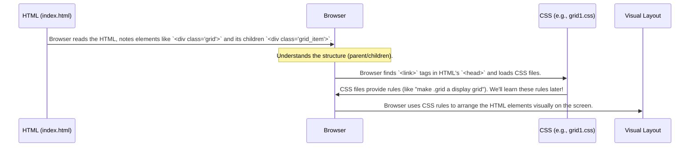

# Chapter 1: HTML Structure for Examples

Welcome to the wonderful world of CSS Grid! Before we start arranging elements like magic, we first need to understand the basic building blocks we'll be working with. Think of it like building with LEGOs – you need the bricks before you can build a spaceship! In web development, our "bricks" are HTML elements.

This chapter will show you the simple HTML structure used in the `CSSgrid-master` project examples. Understanding this structure is the first step to seeing how CSS Grid layouts are created.

## Why Do We Need a Specific Structure?

Imagine you want to organize books on a new bookshelf. First, you need the bookshelf itself (the container), and then you need the books (the items) to place on it.

CSS Grid works similarly. It needs:
1.  A **parent element** (the container) that will become the "bookshelf".
2.  **Child elements** (the items) inside the parent, which will be the "books" arranged by the grid rules.

Our `index.html` file contains several examples of this structure, ready for us to apply CSS Grid rules.

## The Basic HTML Pattern

Let's look at the core pattern used in `index.html` for each example.

**1. The Grid Container (The Bookshelf)**

Each grid example starts with a parent `<div>` element. This `div` acts as the container for our grid items. To tell CSS *which* container we want to style, we give it a specific `class` attribute.

```html
<!-- This is the parent container for our first grid example -->
<div class="grid">
    <!-- Grid items will go inside here -->
    ...
</div>
```

In this snippet, `<div class="grid">` is our container. The `class="grid"` part is like giving our bookshelf a unique label, so we can later tell CSS, "Hey, apply grid rules to the shelf labeled 'grid'!"

**2. The Grid Items (The Books)**

Inside the container `div`, we place the elements we want to arrange. These are the child elements, often also `<div>`s. Like the container, we give these items a `class` so we can potentially style them individually or refer to them collectively.

```html
<div class="grid">
    <!-- These are the child items inside the container -->
    <div class="grid_item">&#x2681;</div>
    <div class="grid_item">&#x2680;</div>
    <div class="grid_item">&#x2682;</div>
    <!-- ... more items ... -->
</div>
```

Here, each `<div class="grid_item">` is an item within our "grid" container. They are like the books on our "grid" bookshelf. The strange codes like `&#x2681;` are just ways to display special characters (like dice faces 🎲) on the page – you could put text, images, or other content here too!

## Putting It Together: A Full Example Snippet

Let's look at the first complete example structure from `index.html`:

```html
<!-- First Example: Container with class="grid" -->
<div class="grid">
    <!-- Items inside the container, each with class="grid_item" -->
    <div class="grid_item">&#x2681;</div>
    <div class="grid_item">&#x2680;</div>
    <div class="grid_item">&#x2682;</div>
    <div class="grid_item">&#x2683;</div>
    <div class="grid_item">&#x2684;</div>
    <div class="grid_item">&#x2685;</div>
    <div class="grid_item">&#x257890;</div>
</div>
```

This simple structure – a parent `div` with a class (e.g., `grid`) and several child `div`s with their own class (e.g., `grid_item`) – is repeated for all the examples in `index.html`, just with different class names (like `grid2` and `grid_item2`, `grid3` and `grid_item3`, etc.) to keep the examples separate.

```html
<!-- Second Example: Notice the different class names -->
<div class="grid2">
    <div class="grid_item2">1️⃣</div>
    <div class="grid_item2">2️⃣</div>
    <div class="grid_item2">3️⃣</div>
    <div class="grid_item2">4️⃣</div>
    <div class="grid_item2">5️⃣</div>
    <div class="grid_item2">6️⃣</div>
</div>
```

This consistent structure is the foundation upon which all the CSS Grid magic in the upcoming chapters will be built.

## How the Browser Sees It (Under the Hood)

When you open `index.html` in a web browser, it first reads this HTML code. It understands the parent-child relationships you've defined.



Right now, if you only looked at the HTML, the elements would mostly just stack on top of each other. The actual grid appearance comes from the CSS rules linked in the `<head>` of `index.html` (like `<link rel="stylesheet" href="css/grid1.css">`). We'll explore those CSS rules step-by-step in the next chapters.

## Conclusion

Great job! You've taken the first step by understanding the basic HTML structure needed for our CSS Grid examples. Remember the key idea: we need a **parent container** (like `<div class="grid">`) and **child items** (like `<div class="grid_item">`) inside it. This structure acts as the skeleton for our layouts.

In the next chapter, we'll look at some basic styling applied to these elements to make them visible before we start arranging them with CSS Grid.

Ready to add some color? Let's move on to [Chapter 2: Common Visual Styling](02_common_visual_styling_.md).

---

Generated by [AI Codebase Knowledge Builder](https://github.com/The-Pocket/Tutorial-Codebase-Knowledge)