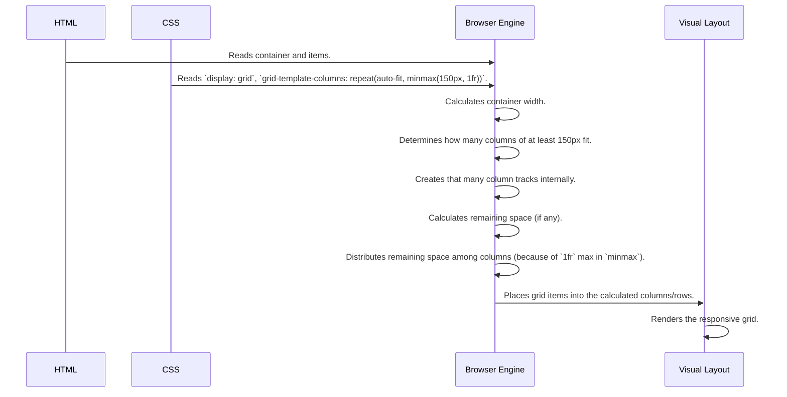

# Chapter 4: Flexible and Automatic Track Sizing

Welcome to Chapter 4! In [Chapter 3: Grid Container & Basic Track Definition](03_grid_container___basic_track_definition_.md), we learned how to create a grid container and define basic columns and rows using fixed sizes like pixels (`px`). That's great for predictable layouts, but what happens when the screen size changes, or you don't know exactly how wide your content needs to be?

Imagine building a bookshelf with fixed-width sections. It works, but it's not very adaptable. What if you need to fit wider books later, or want the shelf sections to adjust based on the room size? Fixed sizes aren't always flexible enough!

This is where CSS Grid truly shines. It offers powerful ways to create flexible and automatic track sizes that adapt to the available space and content. Think of it like having elastic dividers for your grid that stretch and shrink as needed!

## Why Do We Need Flexible Sizing?

Using fixed pixel values (like `100px`) is simple, but it has drawbacks:
*   **Not Responsive:** A layout fixed to `300px` wide might look okay on a desktop but will overflow or require scrolling on a small phone screen.
*   **Wasted Space:** If the container is wider than the sum of your fixed-width columns, you might end up with awkward empty space.
*   **Content Overflow:** If content inside a fixed-size cell is larger than the cell, it might overflow or be cut off.

Flexible and automatic sizing solves these problems, allowing grids to adjust gracefully. Let's explore the tools CSS Grid provides!

## Key Concepts for Flexible Tracks

### 1. The `fr` Unit: Sharing the Leftovers

Meet the `fr` unit – it stands for "fraction" and is the star of flexible grid sizing. It allows you to distribute the *available space* within the grid container proportionally.

Imagine you have a pizza, and you want to share the remaining slices equally among three friends. The `fr` unit works like that!

Let's say we want three columns that share the available width equally:

```css
/* Example CSS */
.grid-flexible {
  display: grid;
  width: 600px; /* Let's give the container a width for this example */
  border: 2px solid blue; /* To see the container */

  /* Each column gets 1 fraction (equal share) of the available space */
  grid-template-columns: 1fr 1fr 1fr;
}
```

**Explanation:**

*   `grid-template-columns: 1fr 1fr 1fr;`: We define three columns. Each `1fr` tells the browser: "Give this column one equal share of the available space inside the `.grid-flexible` container."
*   **Result:** If the container is `600px` wide (and assuming no gaps for now), each column will be `200px` wide (600 / 3 = 200). If the container was `900px` wide, each column would become `300px` wide. The `fr` unit automatically adapts!

You can also mix `fr` units with other units, or give different fractions:

```css
/* Example CSS */
.grid-mixed {
  display: grid;
  width: 600px;
  border: 2px solid green;

  /* Column 1: fixed 100px */
  /* Column 2: gets 1 fraction of remaining space */
  /* Column 3: gets 2 fractions (twice as much as Col 2) */
  grid-template-columns: 100px 1fr 2fr;
}
```

**Explanation:**

*   `grid-template-columns: 100px 1fr 2fr;`:
    1.  The browser first assigns `100px` to the first column.
    2.  Remaining space = `600px - 100px = 500px`.
    3.  This `500px` is then divided into `1 + 2 = 3` total fractions.
    4.  Each fraction is worth `500px / 3 ≈ 166.67px`.
    5.  Column 2 (`1fr`) gets `1 * 166.67px ≈ 166.67px`.
    6.  Column 3 (`2fr`) gets `2 * 166.67px ≈ 333.33px`.

The `fr` unit is fantastic for distributing space flexibly.

### 2. `minmax()` Function: Setting Size Limits

Sometimes you want flexibility, but within certain boundaries. Maybe a column should stretch, but never be smaller than `100px` or larger than `300px`. The `minmax()` function is perfect for this.

Think of it like an adjustable shelf support that can slide between a minimum and maximum height.

```css
/* Example CSS */
.grid-constrained {
  display: grid;
  width: 500px; /* Container width */
  border: 2px solid orange;

  /* Col 1: At least 100px, at most 1fr (takes available space) */
  /* Col 2: Exactly 150px */
  /* Col 3: At least 50px, at most 200px */
  grid-template-columns: minmax(100px, 1fr) 150px minmax(50px, 200px);
}
```

**Explanation:**

*   `minmax(min_value, max_value)`: This function defines a size range for a track.
*   `minmax(100px, 1fr)`: The first column will try to take `1fr` of the available space, BUT it will never shrink below `100px`. If `1fr` calculates to less than `100px`, it will be `100px`. If `1fr` is more, it takes that `1fr` value.
*   `150px`: The second column is fixed at `150px`.
*   `minmax(50px, 200px)`: The third column must be at least `50px` tall and at most `200px` tall. If its content tries to push it wider, it stops at `200px`. If there's not much space, it won't go below `50px`.

`minmax()` gives you fine-grained control over flexibility.

### 3. `repeat()` Function: Avoiding Repetition

Writing `1fr 1fr 1fr 1fr 1fr` for five equal columns is tedious. The `repeat()` function simplifies this.

```css
/* Example CSS */
.grid-repeated {
  display: grid;
  width: 500px;
  border: 2px solid purple;

  /* Instead of: 100px 100px 100px 100px 100px */
  grid-template-columns: repeat(5, 100px);

  /* Instead of: 1fr 1fr 1fr */
  /* grid-template-columns: repeat(3, 1fr); */

  /* You can even repeat patterns! */
  /* Creates 6 columns: 50px 1fr 50px 1fr 50px 1fr */
  /* grid-template-columns: repeat(3, 50px 1fr); */
}
```

**Explanation:**

*   `repeat(count, size_list)`: This function repeats the `size_list` for the specified `count`.
*   `repeat(5, 100px)`: Creates 5 columns, each `100px` wide.
*   `repeat(3, 1fr)`: Creates 3 columns, each `1fr` wide.
*   `repeat(3, 50px 1fr)`: Repeats the pattern `50px 1fr` three times.

`repeat()` makes defining grids with many tracks much cleaner.

### 4. `auto-fit` & `auto-fill`: Automatic Column Creation

This is where things get really exciting for responsive design! Imagine you want your grid to automatically create *as many columns as can fit* within the container's width, without you having to specify the exact number.

Think of automatically adding or removing dividers in a drawer based on how wide the drawer is.

We use `auto-fit` or `auto-fill` keywords inside the `repeat()` function instead of a fixed count. They are often combined with `minmax()` to specify the ideal size range for these automatic columns.

```css
/* Example CSS */
.grid-auto-columns {
  display: grid;
  width: 100%; /* Let the container take full screen width */
  border: 2px solid red;

  /* Create as many columns as fit. Each column wants to be */
  /* at least 150px wide, but can grow to 1fr to fill space. */
  grid-template-columns: repeat(auto-fit, minmax(150px, 1fr));

  /* Add some spacing between items */
  gap: 10px; /* We'll cover gap in the next chapter! */
}

/* Basic item styling */
.grid-auto-columns > div {
  background-color: lightcoral;
  padding: 20px;
  text-align: center;
}
```

**Explanation:**

*   `repeat(auto-fit, minmax(150px, 1fr))`:
    *   `auto-fit`: Tells the browser to figure out how many columns can fit.
    *   `minmax(150px, 1fr)`: Defines the size for *each* potential column. Each column must be at least `150px`. If there's extra space after fitting as many `150px` columns as possible, `auto-fit` will make the existing columns grow (up to `1fr`) to fill that space.
*   **Result:**
    *   On a wide screen (e.g., 1000px), you might get 5 or 6 columns (1000px / ~150px). The `1fr` part will make them stretch to fill the full 1000px width.
    *   On a narrow screen (e.g., 400px), you might only get 2 columns (400px / ~150px), which then stretch to fill the 400px width.
    *   If the screen is very narrow (e.g., 200px), you might only get 1 column, which stretches to fill the 200px width.

**`auto-fit` vs `auto-fill`:**
They behave similarly most of the time. The main difference is when the container is wide enough to fit more columns than you have items.
*   `auto-fill` will create empty tracks (imagine empty slots).
*   `auto-fit` will collapse those empty tracks, making the existing items expand to fill the space (often what you want).

Using `repeat(auto-fit, minmax(min_width, 1fr))` is a powerful technique for creating responsive layouts *without needing media queries*!

## How It Works (Under the Hood)

When the browser encounters these flexible units and functions, it performs calculations to determine the final grid structure:

1.  **Fixed Sizes First:** It resolves any fixed sizes (like `px`, `%`) and calculates space needed for content-based sizes (`min-content`, `max-content`, `auto`).
2.  **Calculate Available Space:** It determines how much space is left in the container after accounting for fixed sizes and any grid gaps ([Chapter 5: Grid Gaps (Gutters)](05_grid_gaps__gutters__.md)).
3.  **Distribute `fr` Units:** It divides the available space among the tracks specified with `fr` units, according to their fraction values.
4.  **Apply `minmax()`:** It ensures that tracks defined with `minmax()` respect their minimum and maximum size constraints, potentially adjusting the calculated sizes from step 3.
5.  **Handle `auto-fit`/`auto-fill`:** If `repeat(auto-fit, ...)` or `repeat(auto-fill, ...)` is used, the browser calculates how many tracks of the specified size (`minmax()` range) can fit into the container's width. It then creates that many tracks. `auto-fit` additionally collapses tracks that end up empty.
6.  **Render Layout:** The final calculated track sizes are used to position the grid items.



## Code Examples in `CSSgrid-master`

You can see these concepts in action in the project files!

*   **`css/grid1.css`:** This file heavily experiments with these concepts in the commented-out sections and the final rule:
    ```css
    /* css/grid1.css */
    .grid{
      /* ... other examples commented out ... */

      /* Final rule uses auto-fit and minmax for responsiveness */
      grid-template-columns: repeat(auto-fit, minmax(20px, 1fr));
      /* This creates columns that are at least 20px wide, */
      /* but will stretch equally (1fr) to fill container width. */
      /* The number of columns adjusts automatically based on width. */
    }
    ```
*   **`css/grid2.css`:** Uses `repeat` with `fr` for equal columns.
    ```css
    /* css/grid2.css */
    .grid2{
        display: grid;
        /* 5 columns, each taking an equal fraction of space */
        grid-template-columns: repeat(5, 1fr);
        /* 3 rows, each 100px tall */
        grid-template-rows: repeat(3, 100px);
        /* ... */
    }
    ```

Explore these files to see practical applications!

## Conclusion

You've unlocked some of the most powerful features of CSS Grid! Fixed sizes are useful, but flexible and automatic sizing makes your layouts truly adaptive and robust.

*   Use the **`fr` unit** to distribute available space proportionally.
*   Use **`minmax()`** to set flexible sizes with minimum and/or maximum limits.
*   Use **`repeat()`** to define multiple tracks concisely.
*   Use **`repeat()` with `auto-fit` or `auto-fill`** and `minmax()` to create automatically responsive columns that adjust to the container width.

These tools allow you to build complex, responsive layouts with surprisingly little code, often eliminating the need for complex media queries.

Now that we know how to size our tracks, let's learn how to create space *between* them!

Ready to add some breathing room? Let's move on to [Chapter 5: Grid Gaps (Gutters)](05_grid_gaps__gutters__.md).

---

Generated by [AI Codebase Knowledge Builder](https://github.com/The-Pocket/Tutorial-Codebase-Knowledge)