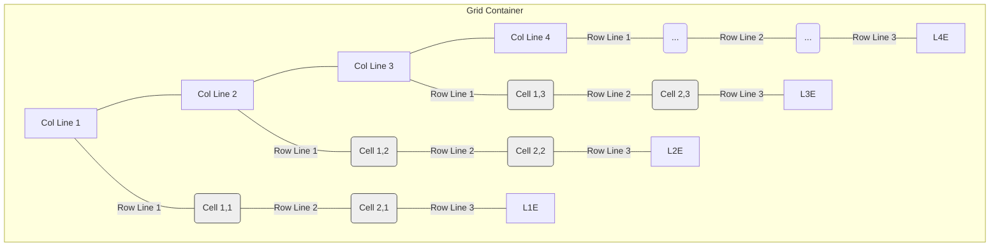

# Chapter 6: Line-Based Item Placement

Welcome to Chapter 6! In [Chapter 5: Grid Gaps (Gutters)](05_grid_gaps__gutters__.md), we learned how to create nice spacing between our grid items using `gap`. So far, the browser has been automatically placing our items into the grid cells, filling them one by one. This is called "auto-placement".

But what if you want more control? What if you want a *specific* item to sit in a *specific* spot on the grid, or even stretch across multiple rows or columns? Imagine you're arranging furniture in a room plan. You don't just throw furniture in randomly; you decide exactly where the sofa goes, where the table goes, and how much space they take up.

Line-based placement in CSS Grid lets you do just that! It allows you to tell the browser precisely where to put each grid item, overriding the default auto-placement.

## The Big Idea: Using Grid Lines

To place items precisely, we first need a way to refer to the different locations on our grid. CSS Grid gives us this by numbering the lines that form the grid structure.

Think of your grid like graph paper. It has horizontal lines and vertical lines.

*   **Vertical Lines:** Separate the columns.
*   **Horizontal Lines:** Separate the rows.

CSS Grid automatically numbers these lines, starting from `1`.

Let's imagine a simple 3-column, 2-row grid:



*   **Column Lines:** We have 4 vertical lines, numbered 1 to 4 from left to right.
*   **Row Lines:** We have 3 horizontal lines, numbered 1 to 3 from top to bottom.

Now we can use these line numbers to tell an item exactly where to start and end.

## Key Concepts: The Placement Properties

We use specific CSS properties on the **grid items** (not the container) to place them using line numbers.

### 1. `grid-column-start` and `grid-column-end`

These properties control the vertical boundaries of a grid item.

*   `grid-column-start: <line_number>;`: Tells the item which vertical grid line its left edge should align with.
*   `grid-column-end: <line_number>;`: Tells the item which vertical grid line its right edge should align with.

**Example:** Place an item in the second column of our 3-column grid. The second column is between column line 2 and column line 3.

```css
/* Apply this to a specific grid item */
.my-item {
  grid-column-start: 2; /* Start at vertical line 2 */
  grid-column-end: 3;   /* End at vertical line 3 */

  /* Make it stand out */
  background-color: orange;
}
```

**Result:** The item with class `my-item` will sit precisely in the second column.

**Spanning Columns:** What if we want an item to cover the first two columns? It needs to start at line 1 and end at line 3.

```css
.item-spanning-columns {
  grid-column-start: 1; /* Start at line 1 */
  grid-column-end: 3;   /* End at line 3 */

  background-color: lightgreen;
}
```

**Result:** This item now occupies the space of the first and second columns combined.

### 2. `grid-row-start` and `grid-row-end`

These work exactly like the column properties but control the horizontal boundaries.

*   `grid-row-start: <line_number>;`: Tells the item which horizontal grid line its top edge should align with.
*   `grid-row-end: <line_number>;`: Tells the item which horizontal grid line its bottom edge should align with.

**Example:** Place an item in the second row of our 2-row grid. The second row is between row line 2 and row line 3.

```css
.item-in-second-row {
  grid-row-start: 2; /* Start at horizontal line 2 */
  grid-row-end: 3;   /* End at horizontal line 3 */

  background-color: skyblue;
}
```

**Result:** This item will sit precisely in the second row.

**Spanning Rows:** To span both rows, start at line 1 and end at line 3.

```css
.item-spanning-rows {
  grid-row-start: 1; /* Start at line 1 */
  grid-row-end: 3;   /* End at line 3 (since it's a 2-row grid) */

  background-color: pink;
}
```

**Result:** This item now occupies the height of the first and second rows combined.

### 3. Shorthand Properties (Easier Typing!)

Writing `start` and `end` all the time can be tedious. CSS provides helpful shorthands.

*   **`grid-column: <start_line> / <end_line>;`**
    Combines `grid-column-start` and `grid-column-end`.
    ```css
    .my-item {
      /* Same as grid-column-start: 2; grid-column-end: 3; */
      grid-column: 2 / 3;
    }
    .item-spanning-columns {
      /* Same as grid-column-start: 1; grid-column-end: 3; */
      grid-column: 1 / 3;
    }
    ```

*   **`grid-row: <start_line> / <end_line>;`**
    Combines `grid-row-start` and `grid-row-end`.
    ```css
    .item-in-second-row {
      /* Same as grid-row-start: 2; grid-row-end: 3; */
      grid-row: 2 / 3;
    }
    .item-spanning-rows {
      /* Same as grid-row-start: 1; grid-row-end: 3; */
      grid-row: 1 / 3;
    }
    ```

*   **`grid-area: <row_start> / <col_start> / <row_end> / <col_end>;`**
    The ultimate shorthand! It defines all four lines in one go. The order is important: Top / Left / Bottom / Right.
    ```css
    /* Place an item in the cell at Row 2, Column 3 */
    /* (Starts Row Line 2, Col Line 3; Ends Row Line 3, Col Line 4) */
    .specific-cell-item {
      grid-area: 2 / 3 / 3 / 4;
      background-color: yellow;
    }

    /* Make an item span from Row 1, Col 1 to Row 2, Col 3 */
    /* (Starts Row Line 1, Col Line 1; Ends Row Line 2, Col Line 3) */
    .big-item {
      grid-area: 1 / 1 / 2 / 3;
      background-color: purple;
      color: white; /* Make text visible */
    }
    ```

These shorthands make your CSS cleaner once you get used to the order.

**Tip:** You can also use the keyword `span` with `grid-column-end` and `grid-row-end` (or the shorthands) to say "span this many tracks" instead of specifying the end line number.
Example: `grid-column: 2 / span 3;` means "Start at column line 2 and span 3 columns."

## How It Works (Under the Hood)

When you apply these placement properties to a grid item, you're essentially giving the browser specific instructions that override its default behavior.

1.  **Grid Setup:** The browser first sets up the grid container and defines the tracks and line numbers based on `display: grid`, `grid-template-columns`, and `grid-template-rows`, as we learned in [Chapter 3: Grid Container & Basic Track Definition](03_grid_container___basic_track_definition_.md).
2.  **Item Placement:** Instead of placing items one by one automatically, the browser checks each item.
    *   **If an item has placement properties** (like `grid-column` or `grid-area`): The browser uses the specified line numbers to position that item precisely on the grid, potentially reserving multiple cells if the item spans.
    *   **If an item does *not* have placement properties:** The browser places it in the *next available empty cell* according to the normal auto-placement flow, skipping over cells already occupied by manually placed items.
3.  **Rendering:** The browser draws the grid and all the items in their calculated positions.

Here's a simplified view:

```mermaid
sequenceDiagram
    participant HTML
    participant CSS
    participant Browser as Browser Engine
    participant Layout as Visual Layout

    HTML->>Browser: Reads grid container and items (e.g., `.item-a`, `.item-b`).
    CSS->>Browser: Reads grid container rules (`display: grid`, tracks).
    CSS->>Browser: Reads item rules (e.g., `.item-a { grid-column: 2 / 4; }`).
    Browser->>Browser: Creates internal grid structure with numbered lines.
    Note over Browser: Sees `.item-a` has placement rules.
    Browser->>Layout: Places `.item-a` starting at column line 2, ending at line 4. Reserves these cells.
    Note over Browser: Sees `.item-b` has no placement rules.
    Browser->>Layout: Places `.item-b` in the next available empty cell(s) via auto-placement.
    Layout->>Layout: Renders the final layout with items in specified positions.
```

## Code Examples in `CSSgrid-master`

Let's look at `css/grid2.css` from the project. It defines a 5-column grid (using `repeat(5, 1fr)`).

```css
/* css/grid2.css - Relevant Snippets */

/* Target the third grid item */
.grid_item2:nth-child(3){
  /* These lines (commented out) would place the 3rd item: */
  /* Starting at column line 4 */
  /* grid-column-start: 4; */
  /* Ending at column line 6 (the end of the 5th column) */
  /* grid-column-end: 6; */

  /* This shorthand does the same: start line 4 / end line 6 */
  /* grid-column: 4/6; */

  /* This alternative shorthand starts at line 4 and spans 2 columns */
  /* grid-column: 4/ span 2; */

  /* This line does the same for rows (if we wanted to span rows 2 & 3) */
  /* grid-row: 2/4; */

  /* This uses the grid-area shorthand: */
  /* row-start / col-start / row-end / col-end */
  /* Place item starting Row Line 2, Col Line 4; ending Row Line 6, Col Line 8 */
  /* Note: If the grid doesn't explicitly have 6 rows / 8 columns, */
  /* the browser might create implicit tracks. */
  grid-area: 2/4/6/8;
}

/* Place the first item normally in the first cell */
.grid_item2:nth-child(1){
  grid-area: 1 / 1 / 2 / 2; /* Row 1, Col 1 */
}

/* Place the second item starting Row Line 3, Col Line 1; */
/* ending Row Line 4, Col Line 3 (spans first two columns of 3rd row) */
.grid_item2:nth-child(2){
  grid-area: 3/1/4/3;
}
```

**Explanation:**

*   The CSS uses `:nth-child()` to select specific items (e.g., the 3rd `div` inside `.grid2`).
*   It then applies `grid-column`, `grid-row`, or `grid-area` with line numbers to position these specific items, overriding the default flow.
*   Notice how `.grid_item2:nth-child(3)` is placed starting at column line 4 and row line 2, taking up a large area, potentially causing the grid to create implicit rows/columns beyond the initial definition if needed.

Experiment by uncommenting the different rules in `css/grid2.css` and refreshing `index.html` to see how the layout changes!

## Conclusion

You've now learned how to become the director of your grid layout! By understanding **grid lines** and using properties like **`grid-column-start`**, **`grid-column-end`**, **`grid-row-start`**, **`grid-row-end`**, and the helpful shorthands **`grid-column`**, **`grid-row`**, and **`grid-area`**, you can precisely place any grid item exactly where you want it. You can make items sit in specific cells or span across multiple tracks.

This line-based placement gives you pinpoint control over your layout. But what if numbering lines feels a bit cumbersome, especially in complex grids? Is there a more descriptive way to define areas? Yes, there is!

Ready to name your grid regions? Let's move on to [Chapter 7: Named Grid Areas Placement](07_named_grid_areas_placement_.md).

---

Generated by [AI Codebase Knowledge Builder](https://github.com/The-Pocket/Tutorial-Codebase-Knowledge)