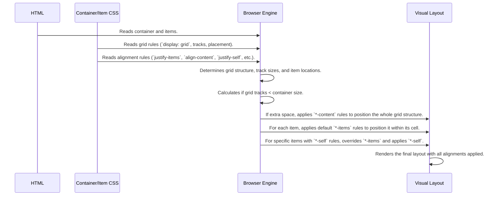

# Chapter 8: Grid and Item Alignment

Welcome to Chapter 8! In [Chapter 7: Named Grid Areas Placement](07_named_grid_areas_placement_.md), we discovered a super intuitive way to lay out our grid using `grid-template-areas`, like sketching a map. We've learned how to define the grid structure, size the tracks, add gaps, and place items using lines or names.

But what happens *inside* those grid cells? And what if our whole grid structure doesn't fill up its container? Sometimes, items might be smaller than the grid area they're assigned to. Where do they sit within that space? Top-left? Center? Stretched out? Also, if you define a grid with fixed-size tracks (like `100px 100px`) inside a larger container (like `500px` wide), where does that `200px` wide grid sit within the `500px` space? Left? Right? Center?

This chapter tackles these exact questions! We'll learn how to control the **alignment** – how items are positioned within their grid cells, and how the entire set of grid tracks is positioned within the grid container when there's extra space.

## Why Control Alignment?

Imagine you have a picture frame (the grid cell) and a photo (the grid item) that's smaller than the frame. You need to decide how to position the photo:
*   Push it to the top-left corner?
*   Center it perfectly?
*   Stick it to the bottom-right?
*   Maybe even stretch the photo to fill the frame (though usually not great for photos!)?

CSS Grid provides properties to make these precise adjustments. Similarly, if you have several picture frames arranged on a large wall (the grid container), and they don't cover the whole wall, you need to decide how to arrange the group of frames:
*   Push them all to the left side?
*   Center the whole group on the wall?
*   Spread them out evenly across the wall?

These alignment controls give your layouts a final layer of polish and precision.

## Key Concepts: Alignment Properties

CSS Grid uses pairs of properties for alignment. The pattern is quite consistent:

1.  **Axis:**
    *   `justify-...`: Controls alignment along the **horizontal** axis (inline direction, like text in a row). Think left-to-right.
    *   `align-...`: Controls alignment along the **vertical** axis (block direction, like paragraphs stacking up). Think top-to-bottom.

2.  **Target:**
    *   `...-items`: Applied to the **grid container**, sets the *default* alignment for all **items** within their individual grid areas. (Controls the photo inside the frame).
    *   `...-content`: Applied to the **grid container**, aligns the **entire grid structure** (all the tracks together) within the container *if* the grid tracks don't fill the container. (Controls the group of frames on the wall).
    *   `...-self`: Applied to a **specific grid item**, overrides the default alignment set by `...-items` just for that one item. (Lets you position one specific photo differently inside its frame).

Let's break these down.

### 1. Aligning Items Within Their Cells (`align-items` and `justify-items`)

These properties are set on the **grid container** and apply to *all* grid items inside it. They determine how an item is positioned within the bounds of its grid area if the item is smaller than the area.

*   `align-items`: Controls vertical alignment within the cell.
*   `justify-items`: Controls horizontal alignment within the cell.

**Common Values:**
*   `stretch` (Default): Makes the item fill the whole grid area (both horizontally for `justify-items` and vertically for `align-items`). This is why you often don't *see* alignment issues initially – items stretch to fit!
*   `start`: Aligns the item to the start edge of its area (top edge for `align-items`, left edge for `justify-items`).
*   `end`: Aligns the item to the end edge of its area (bottom edge for `align-items`, right edge for `justify-items`).
*   `center`: Centers the item within its area (vertically for `align-items`, horizontally for `justify-items`).

**Example:** Let's center all items vertically and align them horizontally to the end (right side) within their cells. Assume items have a fixed size so they don't stretch.

```html
<!-- Basic HTML -->
<div class="alignment-container">
  <div class="item">1</div>
  <div class="item">2</div>
  <div class="item">3</div>
  <div class="item">4</div>
</div>
```

```css
/* CSS on the Container */
.alignment-container {
  display: grid;
  grid-template-columns: 100px 100px; /* Define some tracks */
  grid-template-rows: 100px 100px;
  border: 2px dashed blue; /* See container */
  height: 250px; /* Make container taller than rows */
  width: 250px; /* Make container wider than columns */

  /* Align all items vertically */
  align-items: center;

  /* Align all items horizontally */
  justify-items: end;
}

/* Give items a size so they don't stretch */
.alignment-container .item {
  background-color: lightcoral;
  width: 50px; /* Smaller than column width */
  height: 50px; /* Smaller than row height */
  text-align: center;
  line-height: 50px; /* Center text vertically in item */
}
```

**Explanation:**

*   `align-items: center;`: Tells all items inside `.alignment-container` to position themselves in the vertical middle of their respective grid cells.
*   `justify-items: end;`: Tells all items to position themselves against the right edge of their grid cells.
*   **Result:** Each number (1, 2, 3, 4) will appear in a 50x50 box, centered vertically and pushed to the right within its 100x100 grid cell.

### 2. Overriding Alignment for a Single Item (`align-self` and `justify-self`)

What if you want *most* items centered, but one specific item should be stretched? You use the `...-self` properties directly on that **grid item**.

*   `align-self`: Overrides `align-items` for this specific item (vertical).
*   `justify-self`: Overrides `justify-items` for this specific item (horizontal).

They accept the same values (`stretch`, `start`, `end`, `center`).

**Example:** Let's make the first item (`.item:nth-child(1)`) stretch horizontally, overriding the container's `justify-items: end;`.

```css
/* Add this CSS rule for the specific item */
.alignment-container .item:nth-child(1) {
  /* Override the container's justify-items: end */
  justify-self: stretch;

  /* Let's also make it align to the start vertically */
  align-self: start;

  background-color: lightblue; /* Different color to see it */
  /* width/height are removed by 'stretch', but we'll keep height for align-self demo */
  height: 50px;
}
```

**Explanation:**

*   `justify-self: stretch;`: Applied only to the first item, it ignores the `justify-items: end` from the container and stretches horizontally to fill its 100px wide cell. Its explicit `width: 50px;` is overridden.
*   `align-self: start;`: Applied only to the first item, it ignores the `align-items: center` from the container and aligns to the top edge of its cell. Its `height: 50px;` is respected.
*   **Result:** Item 1 will be a 100px wide, 50px tall blue box at the top-left of its cell. Items 2, 3, and 4 will still be 50x50 red boxes centered vertically and aligned right in their cells.

### 3. Aligning the Entire Grid (`align-content` and `justify-content`)

These properties are set on the **grid container**. They are only relevant when the total size of your grid tracks (plus gaps) is *smaller* than the grid container itself. They control where the whole block of grid tracks sits within that extra space.

*   `align-content`: Controls vertical alignment of the grid tracks within the container.
*   `justify-content`: Controls horizontal alignment of the grid tracks within the container.

**Common Values:**
*   `start`: Packs tracks against the start edge (top for `align-content`, left for `justify-content`).
*   `end`: Packs tracks against the end edge (bottom for `align-content`, right for `justify-content`).
*   `center`: Centers the tracks within the container.
*   `space-between`: Distributes extra space *between* the tracks; first track is on the start edge, last track is on the end edge.
*   `space-around`: Distributes extra space *around* each track equally (meaning space at the ends is half the space between tracks).
*   `space-evenly`: Distributes extra space *evenly* between tracks and also between tracks and the container edges.
*   `stretch` (Default for `align-content`): Stretches auto-sized rows to fill the container space.

**Example:** Our container (`.alignment-container`) is 250x250. Our grid tracks are 100x100 + 100x100, so the grid itself is 200x200 (ignoring gaps for simplicity). There's 50px of extra space horizontally and vertically. Let's center the grid horizontally and put space between the rows vertically.

```css
/* Modify the container CSS */
.alignment-container {
  display: grid;
  grid-template-columns: 100px 100px;
  grid-template-rows: 100px 100px;
  border: 2px dashed blue;
  height: 250px; /* Extra vertical space */
  width: 250px; /* Extra horizontal space */

  /* --- Item alignment from before (optional here) --- */
  align-items: center;
  justify-items: end;

  /* --- Content alignment --- */
  /* Center the 200px wide grid within the 250px container */
  justify-content: center;

  /* Distribute the 50px extra vertical space between the rows */
  align-content: space-between;
}

/* Item styles remain the same */
.alignment-container .item {
  background-color: lightcoral;
  width: 50px;
  height: 50px;
  text-align: center;
  line-height: 50px;
}
.alignment-container .item:nth-child(1) {
  justify-self: stretch;
  align-self: start;
  background-color: lightblue;
  height: 50px;
}
```

**Explanation:**

*   `justify-content: center;`: Takes the 200px width of the grid tracks and centers it within the 250px container width. There will be 25px of empty space on the left and 25px on the right.
*   `align-content: space-between;`: Takes the 200px height of the grid tracks. It places the first row at the top edge (0px) of the container, the second row at the bottom edge (250px - 100px = 150px), and distributes the remaining 50px space (250px - 100px - 100px = 50px) *between* row 1 and row 2.
*   **Result:** The whole 2x2 grid block will be centered horizontally. Vertically, the first row will be at the top, the second row will be at the bottom, with a 50px gap between them. The item alignments (`align-items`, `justify-items`, `*-self`) still apply *within* each cell relative to its position in the overall grid.

## How It Works (Under the Hood)

Alignment properties are applied relatively late in the layout process, after the grid structure is defined and items are placed into their areas.

1.  **Grid Structure & Placement:** The browser first calculates track sizes (including resolving flexible units like `fr` from [Chapter 4: Flexible and Automatic Track Sizing](04_flexible_and_automatic_track_sizing_.md)) and places items into grid areas (using auto-placement or explicit rules from [Chapter 6: Line-Based Item Placement](06_line_based_item_placement_.md) / [Chapter 7: Named Grid Areas Placement](07_named_grid_areas_placement_.md)).
2.  **Calculate Grid Size vs Container Size:** The browser determines the total size occupied by the grid tracks and gaps. It compares this to the container's size.
3.  **Apply `*-content` Alignment:** If there's extra space in the container, the browser uses `justify-content` and `align-content` rules to shift the *entire block* of grid tracks within the container.
4.  **Apply `*-items` Alignment:** For each grid item, the browser determines the final size and position of its assigned grid area (after `*-content` alignment). It then applies the container's `justify-items` and `align-items` rules to position the item *within* that area, unless overridden.
5.  **Apply `*-self` Alignment:** If an item has `justify-self` or `align-self` rules, these override the corresponding `*-items` rules from the container for that specific item.
6.  **Rendering:** The browser draws everything in its final calculated position.



## Code Examples in `CSSgrid-master`

Let's look at `css/grid4.css`, which uses these properties extensively:

```css
/* css/grid4.css snippet */
.grid4 {
    height: 500px;
    display: grid;
    /* Defines named areas 'e', 'g', 'd' on a grid */
    grid-template:
      "e . . . . " 100px
      ". . . g g " 100px
      "d d . g g" 100px
      / 100px 100px 100px 100px 100px;

    /* Align the CONTENT (the whole 500x300 grid) */
    /* Horizontally align to the end (right) */
    justify-content: end;
    /* Vertically align to the start (top) */
    align-content: start;
    /* place-content is shorthand for align-content / justify-content */
    /* place-content: center; */ /* (This line is commented out) */

    /* Align the ITEMS within their cells (default for all) */
    /* Horizontally stretch items */
    justify-items: stretch;
    /* Vertically stretch items */
    align-items: stretch;
}

/* Assign items to areas */
.grid_item4:nth-child(3) { grid-area: g; }
.grid_item4:nth-child(1) { grid-area: e; }

/* Override alignment for ONE specific item */
.grid_item4:nth-child(2) {
  grid-area: d;
  /* Override justify-items: stretch, align horizontally to start (left) */
  justify-self: start;
  /* Override align-items: stretch, align vertically to end (bottom) */
  align-self: end;
}
```

**Explanation:**

*   `justify-content: end;` and `align-content: start;` push the entire grid structure (which is 500px wide and 300px tall) to the top-right corner of the `.grid4` container (which has `height: 500px`, leaving 200px of empty space at the bottom).
*   `justify-items: stretch;` and `align-items: stretch;` make items try to fill their assigned grid areas by default (e.g., item 1 in area 'e' will stretch to fill its 100x100 cell).
*   Item 2 (`.grid_item4:nth-child(2)`) is assigned to area 'd' (which spans 2 columns, 1 row = 200x100). However, its `justify-self: start;` and `align-self: end;` override the default stretching. Assuming the item has some intrinsic size or styled size smaller than 200x100, it will be positioned in the bottom-left corner of the 'd' area.

Experiment by changing the values (`start`, `center`, `end`, `space-between`, etc.) for `justify-content`, `align-content`, `justify-items`, `align-items`, `justify-self`, and `align-self` in `grid4.css` to see how the layout changes!

## Conclusion

You've mastered the final piece of the core CSS Grid puzzle: alignment! You now know how to precisely control:

*   How all items are aligned within their cells using `justify-items` (horizontal) and `align-items` (vertical) on the container.
*   How to override alignment for a single item using `justify-self` and `align-self` on the item itself.
*   How the entire grid structure is positioned within the container if there's extra space, using `justify-content` (horizontal) and `align-content` (vertical) on the container.

Remember the `justify-*` vs `align-*` (horizontal vs vertical) and `*-items` vs `*-content` vs `*-self` (all items vs whole grid vs single item) distinctions.

With these tools, combined with everything learned in previous chapters – defining tracks ([Chapter 3](03_grid_container___basic_track_definition_.md)), flexible sizing ([Chapter 4](04_flexible_and_automatic_track_sizing_.md)), gaps ([Chapter 5](05_grid_gaps__gutters__.md)), and placement ([Chapter 6](06_line_based_item_placement_.md) & [Chapter 7](07_named_grid_areas_placement_.md)) – you have a powerful toolkit for creating sophisticated, responsive, and precisely controlled layouts on the web.

This concludes the main chapters of the `CSSgrid-master` introductory tutorial. Congratulations on learning the fundamentals of CSS Grid! Keep experimenting with the examples and try building your own layouts. Happy coding!

---

Generated by [AI Codebase Knowledge Builder](https://github.com/The-Pocket/Tutorial-Codebase-Knowledge)