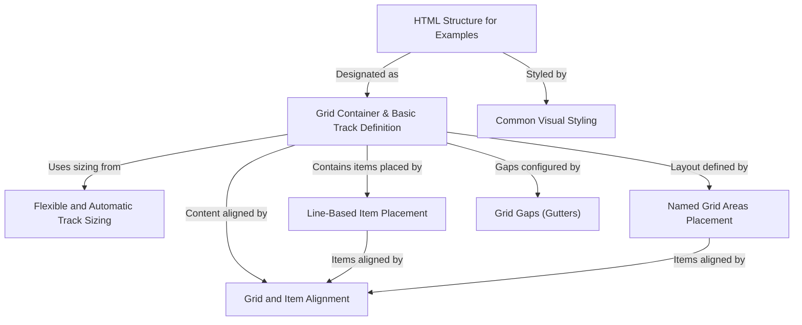

# Tutorial: CSSgrid-master

This project provides simple examples demonstrating **CSS Grid** features.
It shows how to create a *grid container*, define *columns and rows* with different sizing methods, place items using *lines or named areas*, control *alignment*, and add *gaps* between elements.
The examples use basic HTML structure and shared CSS styling for clarity.

**Source Repository:** [https://github.com/ByteMe6/css-grid/tree/CSSgrid-master](https://github.com/ByteMe6/css-grid/tree/CSSgrid-master)

## Chapters

1. [HTML Structure for Examples
](01_html_structure_for_examples_.md)
2. [Common Visual Styling
](02_common_visual_styling_.md)
3. [Grid Container & Basic Track Definition
](03_grid_container___basic_track_definition_.md)
4. [Flexible and Automatic Track Sizing
](04_flexible_and_automatic_track_sizing_.md)
5. [Grid Gaps (Gutters)
](05_grid_gaps__gutters__.md)
6. [Line-Based Item Placement
](06_line_based_item_placement_.md)
7. [Named Grid Areas Placement
](07_named_grid_areas_placement_.md)
8. [Grid and Item Alignment
](08_grid_and_item_alignment_.md)

---

Generated by [AI Codebase Knowledge Builder](https://github.com/The-Pocket/Tutorial-Codebase-Knowledge)